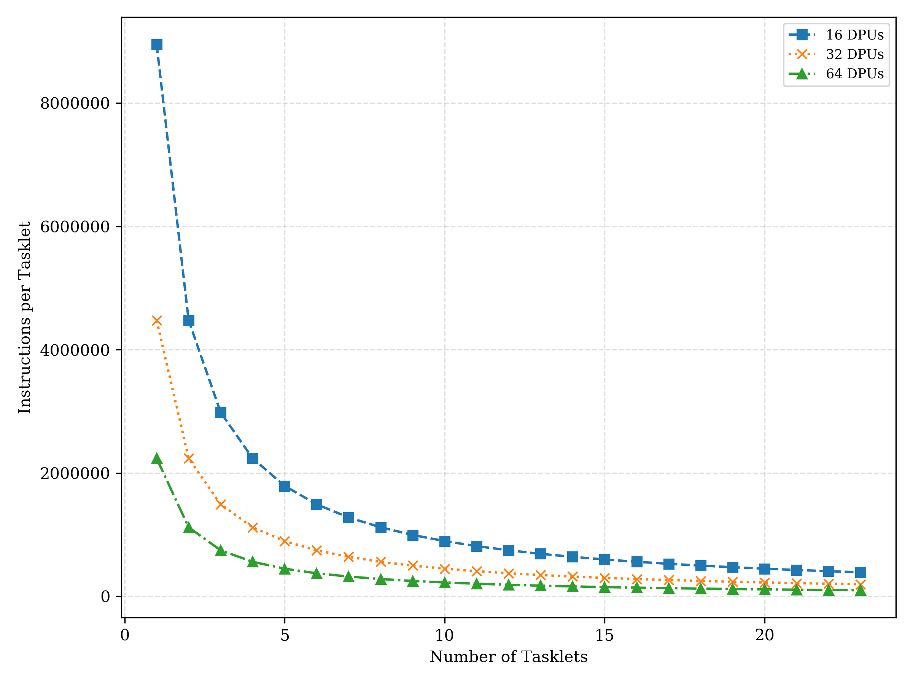
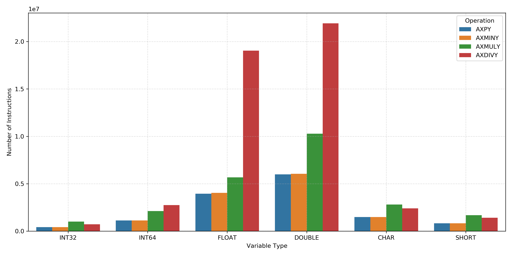
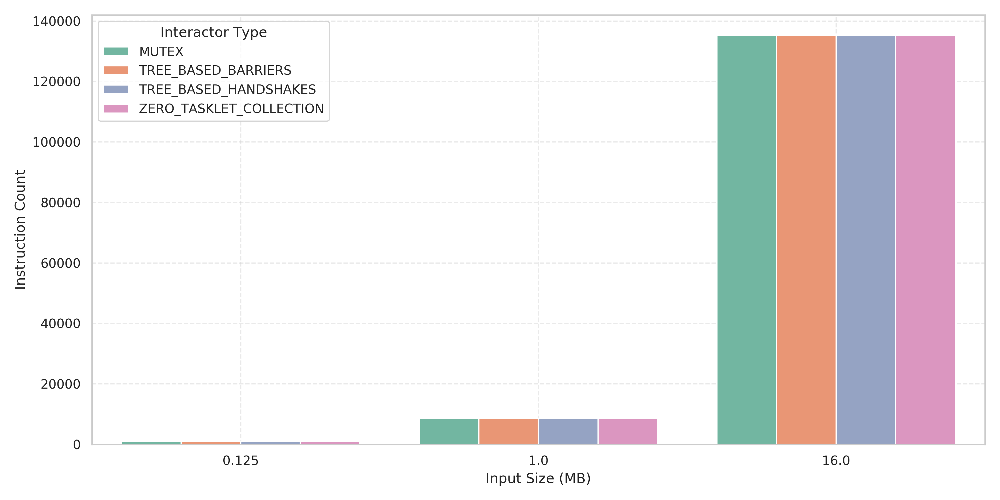
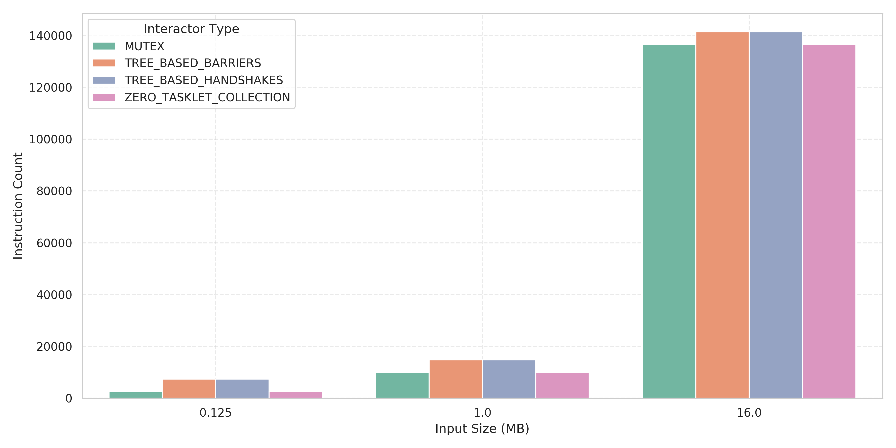
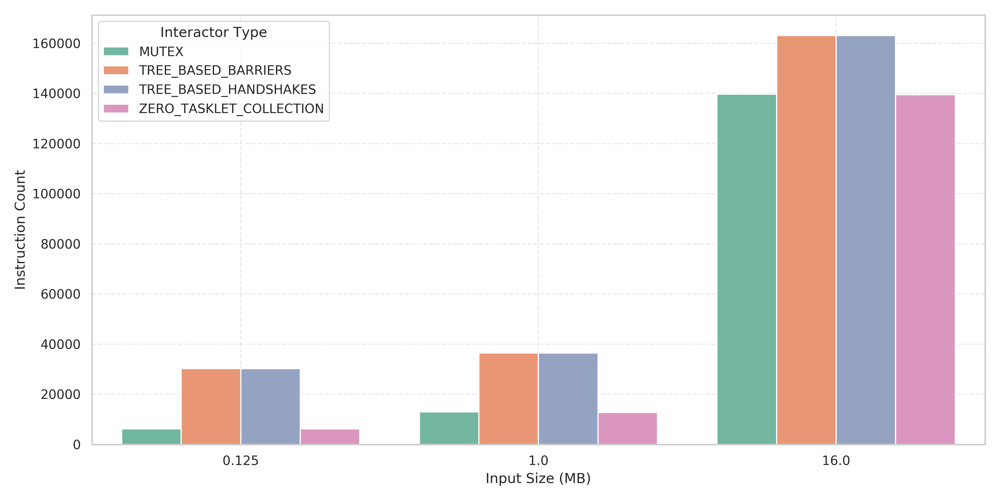

# Report Lab3: Programming a Real Processing-in-Memory Architecture

## Introduction

In this lab we are asked to program the UPMEM PIM architecture for several workloads. We are asked to benchmark the system performance under different configurations, and to both evaluate and analyse the results.

## Task 1: Transfering Data between Main Memory and PIM-enabled Memory

In the first task we are asked to get familiar with the different types of data transfers between the host main memory and the PIM-enabled memory. There are three different types of data transfers `SERIAL`, `PARALLEL`, and `BROADCAST`. `SERIAL` and `PARALLEL` handle data transfer both from CPU to DPUs and DPUs to CPU. `BROADCAST` can only transfer data from the CPU to DPUs so it is unidirectional. 

In Fig~1 We see the memory bandwidth performance of the different transfer types under different loads and DPU counts. The provided data is an average of ten runs which were run with the same configuration, as the performance showed significant variance over different runs and on different devices. We can clearly see that the different input sizes separate the different paths. Within these paths there is no clear distinction between the different transfer types. We can also clearly see that with increasing number of DPUs the bandwidth worsens. The performance loss is roughly 1 divided by the number of DPUs in the case of DPU to CPU transfer. In the case of CPU to DPU transfer we first see a sharp rise and then a roughly linear drop-off in performance that flattens out for high number of DPUs. It also has to be noted that the bandwidth of the DPU to CPU transfer is way bigger than that of the CPU to DPU transfer.

This roughly matches what is to be expected from the transfers. The ~`1/N` drop-off makes sense as the CPU only has limited resources and needs to distribute them over `N` DPUs to handle the data handoff. One thing which contradicts the expectation is that the `BROADCAST` transfer type does not show different performance than the `SERIAL` and `PARALLEL` transfer type. The expectation was that `BROADCAST` would show better performance in the CPU to DPU transfer than the other transfer types, especially in the cases with a larger input size.

The maximum bandwidth at one DPU for CPU to DPU transfer is ~35 MB/s and the maximum for DPU to CPU transfer ~2800 MB/s. The remarkable thing here again is the difference between the transfer directions. For 64 DPUs we get a maximum of ~22 MB/s for CPU to DPU transfer and ~420 MB/s for DPU to CPU. These values also follow the expectation.


## Task 2: AXPY

In the second task we are asked to write a DPU kernel taht executes the `AXPY` operation on a vector and then to benchmark the kernels performance.

### Implementation

The `AXPY` operation was implemented as a simple function in the DPU kernel.

```c
// AXPY: Computes AXPY for a cached block 
static void axpy(T *bufferY, T *bufferX, T alpha, unsigned int l_size) {
    for (unsigned int i = 0; i < l_size; ++i) {
        bufferY[i] = bufferX[i] * alpha + bufferY[i];
    }
}
```

### Results


In Fig~2 we see that the instrutctions per taskelt drop off at a rate of 1 divided by the number of tasklets for all different DPU counts. We also see that a doubling of the DPUs halves the number of instructions per tasklet. This is expected, as there is a set number of instructions that need to be processed which are now distributed over a number of DPUs and tasklets.



## Task 3: Operations and Data Types

In the third task we are asked to extend the implementation from task 2 to also include `AXMINY`(subtraction), `AXMUL>` (multiplication), and `AXDIVY` (division). And then benchmark the performance of the system on the different operations with different data types.

### Implementation

Task 3 is an extension of task 2. It adds sections for the different operation types which are multiplexed via a compiler flag.

```c
// AXMINY: Computes AXMINY for a cached block
static void axminy(T *bufferY, T *bufferX, T alpha, unsigned int l_size) {
    for (unsigned int i = 0; i < l_size; ++i) {
        bufferY[i] = bufferX[i] * alpha - bufferY[i];
    }
}

// AXMLTY: Computes AXMLTY for a cached block
static void axmuly(T *bufferY, T *bufferX, T alpha, unsigned int l_size) {
    for (unsigned int i = 0; i < l_size; ++i) {
        bufferY[i] = bufferX[i] * alpha * bufferY[i];
    }
}

// AXDIVY: Computes AXDIVY for a cached block
static void axdivy(T *bufferY, T *bufferX, T alpha, unsigned int l_size) {
    for (unsigned int i = 0; i < l_size; ++i) {
#if defined(FLOAT) || defined(DOUBLE)
        bufferY[i] = (T)(bufferX[i] * alpha / bufferY[i]);
#else
        bufferY[i] = (bufferY[i] != 0) ? (T)(bufferX[i] * alpha / bufferY[i]) : (T)0;
#endif
    }
}
```

```c
#if defined(AXPY)
        axpy(wram_y, wram_x, alpha, (unsigned int)(mem_access_size / sizeof(T)));
#elif defined(AXMINY)
        axminy(wram_y, wram_x, alpha, (unsigned int)(mem_access_size / sizeof(T)));
#elif defined(AXMULY)
        axmuly(wram_y, wram_x, alpha, (unsigned int)(mem_access_size / sizeof(T)));
#elif defined(AXDIVY)
        axdivy(wram_y, wram_x, alpha, (unsigned int)(mem_access_size / sizeof(T)));
#endif
```

### Results

Fig~3 shows the instruction count for the different types and operations. The two clear outliers are `FLOAT` and `DOUBLE` especially in the case of division we see a signifacnt increase in the number of instructinos. We also see that the number of instructions scales with the type size, `INT32` takes roughly halv as many instructions as `INT64`. Further we can see that `INT32` and `INT64` perform better than other types of the same size. The last observation we can make is that multiplication and division take more instructions than addition.

These results match the expectations. `DOUBLE` and `FLOAT` require floating point operations which are notoriously expensive, especially floating point division is known to come at a high performance cost which is clearly reflected in the data. The scaling with data type size is also clearly visible and makes sense as if we changed the number of inputs is kept constant so a smaller type will inherently need less instructinos. Further we also see that arithmetic operations work especially well on arithemtic types such as `INT32` and `INT64` which is also to be expected as systems are usually desinged to perform best on precisely these operations.



## Task 4: Vector Reduction

In the fourth task we are asked to perform parallel reductions in the DPU kernel. We are asked to implement vector reduction with a single tasklet doing the reductio, a tree-based reduction using barriers, a tree-based reduction with handshakes and a reduction with mutexes. We are asked to evaluate the different approaches.

### Implementation

The four approaches can easily be implemented using the handshake, barrier, and mutex functionality provided for the DPU kernel. The vector reduction algorithm chosen is a simple vector sum algorithm that is executed on each tasklet to compute the sum over its allocated vector. This final result then has to be collected across all tasklets.

```c
// VEC_RED: compute VEC_RED of a cached block
static void vec_red(T* bufferX, unsigned int l_size, unsigned int tasklet_id) {
    for (unsigned int i = 0; i < l_size; ++i) {
        tasklet_results[tasklet_id] += bufferX[i];
    }
}
```


The first implementation uses a barrier to wait for all tasklets to finish executing and then lets the zero-tasklet collect all the values and perform the final vector reduction.

```c
// 0-tasklet collection
static T red_zero_tasklet_collection(unsigned int tasklet_id) {

    // wait for all tasklets to complete
    barrier_wait(&my_barrier);

    if (tasklet_id == 0) {
        T total_sum = 0;
        for (unsigned int i = 0; i < NR_TASKLETS; ++i) {
            total_sum += tasklet_results[i];
        }
        return total_sum;
    }
    return 0;
}
```

The tree-based approach with barriers performs a reduction where successively neighbouring tasklets combine their results. The decision as to which tasklet does the reduction steps is managed through a predetermined hierarchy given by the tasklet-id. The core idea is to wait at the end of each level of the tree to let all tasklets finish before continuing to the next level.

```c
// barrier case:
static T red_tree_based_barriers(unsigned int tasklet_id) {

    // wait for all tasklets to complete
    barrier_wait(&my_barrier);
    // print_tasklets(tasklet_id);

    // find neighbouring tasklets
    for (unsigned int hood = 1; hood < NR_TASKLETS; hood *= 2) {
        // only let the first entry in the hood collect
        if (tasklet_id % (2 * hood) == 0) {
            // check bounds
            if (tasklet_id + hood < NR_TASKLETS) {
                tasklet_results[tasklet_id] += tasklet_results[tasklet_id + hood];
            }
        }
        barrier_wait(&my_barrier);
        // print_tasklets(tasklet_id);
    }
    return tasklet_results[tasklet_id];
}
```

The tree-based approach with handshakes works very similarly to the previous approach. But now instead of having to wait for all tasklets to complete their exectution before going to the next level of the tree, each tasklet only has to wait for its imidiate next neighbour before being able to continue the reduction.

```c
// handshake case:
static T red_tree_based_handshakes(unsigned int tasklet_id) {
    // find neighbouring tasklets
    for (unsigned int hood = 1; hood < NR_TASKLETS; hood *= 2) {
        // only let the first entry in the hood collect
        if (tasklet_id % (2 * hood) == 0) {
            handshake_wait_for(tasklet_id + hood);
            // check bounds
            if (tasklet_id + hood < NR_TASKLETS) {
                tasklet_results[tasklet_id] += tasklet_results[tasklet_id + hood];
            }
        } else {
            handshake_notify();
        }
        // print_tasklets(tasklet_id);
    }
    return tasklet_results[tasklet_id];
}
```

The mutex implementation is the simlest. We have one shared reduction value which is locked behind a mutex so each tasklet, accesses the value when it is done with its computation, deposits its part of the reduction and then vacates the mutex again.

```c
// mutex case:
static T red_mutex(unsigned int tasklet_id) {

    mutex_lock(my_mutex);
    mutex_sum += tasklet_results[tasklet_id];
    mutex_unlock(my_mutex);

    barrier_wait(&my_barrier);
    return mutex_sum;
}
```

### Results

In Fig~4, Fig\~5, and Fig\~6 We see the instruction count for the different implementations in different system configuriations. The figures show that increaseing the tasklet count pronounces the performance differences of the different implementations. We can also see that the relative difference between the different implementations decays significantly with increaseing input size, while the absolute difference stays roughly the same for all three input sizes. The figures show that `MUTEX` and `ZERO_TASKLET_COLLECTION` performa very similarly and `TREE_BASED_BARRIERS` and `TREE_BASED_HANDSHAKES` perform similarly. It can also be seen that the tree based implementations perform worse than the others.

The first observation, that increasing the tasklet count increses the difference follows the expectation, as more tasklets gives more parallelism thus also increaseing the visibility of the observed effects. With this reasoning it also makes sense that for a single tasklet there is no difference in performance. That the absolute difference in performance for the different implementations stays the same over the different input sizes also follows the expectation. This is due to the parallelism only taking effect in the last combination step which scales in the number of tasklets and not in the size of the data. The interesting observation is the difference in performance of the tree-based and non-tree-based final reduction steps. This can be explained thorugh the different algorithms. The tree-based algorithms are more sophisticated algorithms than the non-tree-based algorithms. These more complex structures introduce additional computation. The tree-based final reduction includes two nested loops. While this could be efficient for more complex problems, it is simply a to expensive approach for the simple task of adding the values. So the mutex approach and the zero-tasklet approach which only need to wait for the last tasklet to complete and then can simply sum or have already summed the values outperform the tree-based approaches which at that point still need to do significant computation.






