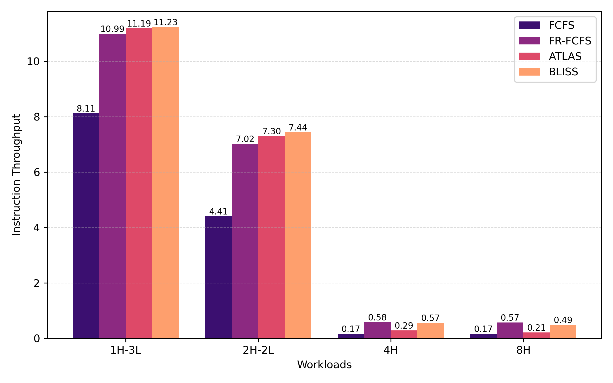
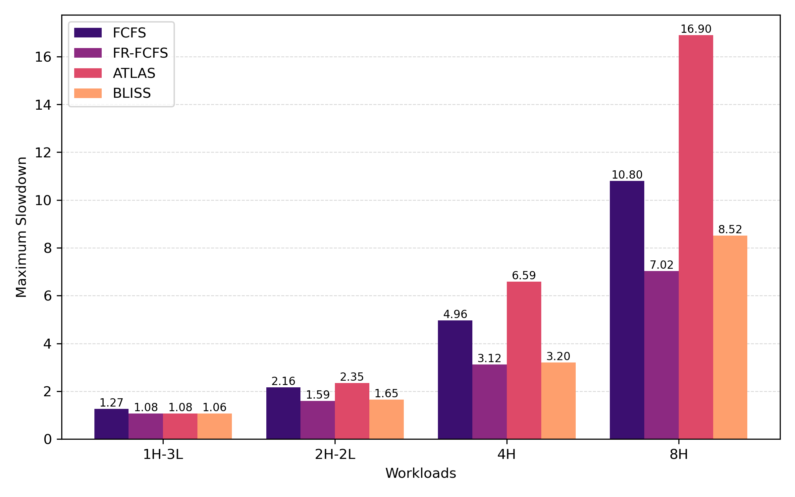

# Report Lab 5: Memory Request Scheduling

## Task 1: Getting Your Hands on Ramulator 2 

### Questions

---

**Question 1:** What kind of a memory system does this configuration specify? Name as many specifications as you can about this system.

The config file is split into two sections, the Frontend and the MemorySystem. We are interseted in the MemorySystem. The system implements generic DRAM. It uses DDR4 with 8GB. The DRAm has 1 channel and 1 rank. The timing corresponds to DDR4 2400R. The controller has a FR-FCFS scheduling policy and uses the AllBank refresh implementation. The Address mapper is RoBaRaCoCh. (The MemorySystem also has a clock_ratio of 3.)

---

**Question 2:** How do you change the input trace file(s) for the SimpleO3 frontend? How do you change how many CPU cycles that Ramulator 2 is going to simulate?

Ramulator is run with the command `./ramulator2 -f config_file.yaml`. To change the input trace we need to change the `traces:` section in the config file. We cannot set the number of cpu cycles but we can change the amount by adjusting the `num_expected_insts:` value in the config file.

---

**Question 3:** Run a four-core multiprogrammed simulation with two cores running the “L” trace (i.e., `low-mem-intensity.trace`) and the other two running the “H” trace (i.e., `high-mem-intensity.trace`). Hint: the traces key expects a list as its value in the configuration file.
Compare the instruction per cycle (IPC) of the application that is running alone (i.e., single-core) versus running together with other applications (i.e., multi-core), how different are they? Briefly explain why.

| Core | Trace |Cycles Recorded | Instructions | IPC  |
|------|-------|----------------|--------------|------|
| 0    | L     | 93159          | 300000       | 3.22 |

| Core | Trace |Cycles Recorded | Instructions | IPC  |
|------|-------|----------------|--------------|------|
| 0    | H     | 498311         | 300000       | 0.60 |

| Core | Trace |Cycles Recorded | Instructions | IPC  |
|------|-------|----------------|--------------|------|
| 0    | L     | 134055         | 300000       | 2.24 |
| 1    | L     | 137983         | 300000       | 2.17 |
| 2    | H     | 720447         | 300000       | 0.42 |
| 3    | H     | 710170         | 300000       | 0.42 |

We can clearly see that for both traces "L" and "H" we have a preformance loss of ~30% in the multi-core system relative to the single-core system. This is due to the multiple cores contending for the limited memory access.

---

**Question 4:** What does the “TraceRecorder” plugin do?

The TraceRecorder plugin logs each memory instruction issued to the controller. It creates a trace file for each channel that holds the instructions issued via this channel. The trace file contains the memory clock cyle, i.e. the timing information, the memory command (ACTIVATE, READ, WRITE, PRECHARGE), and the memory address vector, i.e. the informaiton about the memory address being accessed.

---

**Question 5:** What is the difference between a FCFS scheduler and FRFCFS scheduler? How does it impact system performance?

FCFS stands for Firs-Come-First-Served this means that the commands are scheduled in the order that they arrive in the memory controller.

FR-FCFS stands for First-Ready First-Come-First-Served. This means that the top priority is the command that is ready the eraliest. If two commands are ready in the same cycle then the decision is made via with FCFS as described above.

| Core/Trace | FR-FCFS IPC | FCFS IPC |
|------------|-------------|----------|
| Core-0/L   | 2.24        | 0.87     |
| Core-2/H   | 0.42        | 0.14     |

From the table we can clearly see that FR-FCFS performs a lot better than FCFS. This makes intuitive sense as memory commands can only be serviced when they are ready but FCFS sometimes prioritizes a command that is ready later but arrived eralier than another command. FR-FCFS addresses precisely this issue and the impact can clearly be seen in the data.

## Task 2: Implementing ATLAS

### Structures

ATLAS uses a single meta-controller to cooridnate the collection of the attained service of each thread and to rank the threads. To realise this the meta-controller is defined in the `atlas_meta_controller.h`:

```
// MetaController to handle attained service management and thread ranking
struct ATLASMetaController {

  Clk_t m_clk;

  // total attained service for each thread
  std::map<int, double> total_as;

  // rankin of the threads (lower number -> higher priority)
  std::map<int, int> ranking;

  // incoming as from the threads
  std::map<int, double> as_buffer;

  int n_controllers = 0;
  int n_transmitted = 0;

  void add_controller();

  void transmit_as(std::map<int, double> local_as);

  void update_ranking();

  int get_thread_rank(int thread);
};
```

The implementations of the meta-controller is given in the file `atlas_meta_controller.cpp`. The meta-controller provides two main functions.

`void transmit_as(std::map<int, double> local_as);`: This function is the interface between the individual controllers and the meta-controller. It allows the individual controllers to transmit their local attained service to the meta controller.

`void udpate_ranking();`: This function implements the main functionality of the meta-controller. It is called when at the end of a qunatum all controllers have transmitted their local attained service. The meta-controller then updated the total accumulated service for each thread and ranks according to Rule 2 in the paper[@atlas].

The meta-controller exists as a globally shared struct which is initialized within the scope of the scheduler.

### Controller-Side

The updating of the local attained service and transmitting to the meta-controller for each controller is handled within a plugin implemented in `atlas_plugin.cpp`. The plugin keeps track of the bank ownership of the different threads and uses it to calculate their attained service. The plugin also tracks when a quantum has passed and then transmitts the controllers local attained service to the meta-controller.

### Scheduler

The actual scheduler implementation is found in `atlas_scheduler.cpp`. The scheduler has access to the meta-controllers rankings and uses them to schedule the memory accesses according to Rule 1 from the paper[@atlas].

## Task 3: Implementing BLISS 

### Structures

BLISS keeps a global state to track the blacklisted threads. This global state is defined in the file `bliss_state.h` as:

```
struct BLISSState {
  int last_source_id = -1; // field to store the last thread
  int request_counter = 0; // counter to hold consecutive requests
  std::set<int> blacklist; // blacklist holding the blacklisted threads
  int clearing_counter = 0; // counter to hold keep track of blacklist clearing
};
```
The global BLISS state exists as a globally shared map of `BLISSState` structs with the respective channel as its key. This map is initialized within the scope of the scheduler.

### Controller-Side

The updating of the blacklist is managed by the individual controllers and implemented within in a plugin in `bliss_plugin.cpp`. This plugin tracks the consecutive memory accesses of threads and blacklists them if they exceed a threshold. The plugin is also responsible for clearing the blacklists at the end of each interval.

### Scheduler

The actual scheduler implementation is found in `bliss_scheduler.cpp`. The scheduler has access to the blacklists given tracked in the global BLISS states. It schedules the memory based on the priorities described in the paper[@bliss].

\newpage

## Task 4: valuating ATLAS and BLISS and Comparing Them to Conventional Memory Scheduling Policies



Figure 1. shows the instruction throughput of the different schedulers with different workloads. There is a clear difference between mixed workloads (1H-3L, 2H-2L) and uniform workloads (4H, 8H). The mixed-workloads show a higher instruction throughput than the mixed workloads, but within both groups the relative performance between the different schedulers is fairly similar. This discrepancy can simply be explained by over-all memory usage. If we include low intensity threads then the memory access rate is lower which leads to higher performance as memory is less likely to become a bottleneck.
In the mixed workloads FR-FCFS, ATLAS, and BLISS perform similarly while FCFS performs much worse. This can be explained through the inherent inefficiencies in FCFS scheduling already outlined in Task 1, Question 5. For the uniform workloads we see that while FCFS still performs the wors, there is a sginificant gap between the performance of ATLAS and FR-FCFS or BLISS. This can be explained by the inherent weakness of BLISS. In high workload conditions BLISS will choose one thread as the highest priority. This leads to this thread attaining more service which agian increases its priority. This is a self fulfilling prophecy which effectively serializes the memory accesses. FR-FCFS and BLISS avoid this as FR-FCFS schedules only based on the state of the memory and in a second priority the arrival time, and BLISS will cycle through all requesting threads but once they are all blacklisted will also fall back to FR-FCFS untill it resets the blacklists.

\newpage



Figure 2. shows the maximum slowdown of the different schedulers with different workloads. With increasing total workload a clear increase in maximum slowdown can be seen. In general we can see that FCFS shows worse maximum slowdown than FR-FCFS and BLISS. This is expected as FCFS has inherent inefficiencies which are explained in Task 1 Question 5. The suprising outlier is ATLAS which shows very bad performance in the uniform workloads, but even for the higher intensity mixed workload it shows the worst performance of all the schedulers. This can again be explained with the prioritization of a single thread by ATLAS in the case of a high workload. This causes the thread that gets the lowest priority at the beggining of a high instensity section of the runtime to be almost starved, i.e. it will only be serviced when the threshold is reached. This causes the performance of this particular thread to be canibalized by the other threads.

## References
